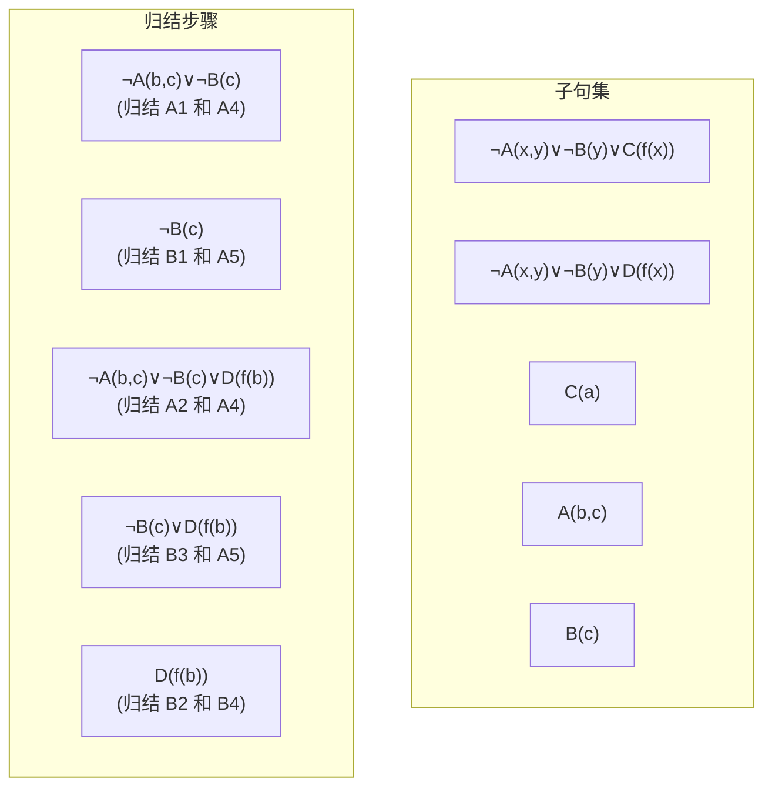

```mermaid
graph TD;
    subgraph 子句集
        A1["¬A(x,y)∨¬B(y)∨C(f(x))"]
        A2["¬A(x,y)∨¬B(y)∨D(f(x))"]
        A3["C(a)"]
        A4["A(b,c)"]
        A5["B(c)"]
    end
    subgraph 归结步骤
        B1["¬A(b,c)∨¬B(c) <br> (归结 A1 和 A4)"]
        B2["¬B(c) <br> (归结 B1 和 A5)"]
        B3["¬A(b,c)∨¬B(c)∨D(f(b)) <br> (归结 A2 和 A4)"]
        B4["¬B(c)∨D(f(b)) <br> (归结 B3 和 A5)"]
        B5["D(f(b)) <br> (归结 B2 和 B4)"]
    end
```

